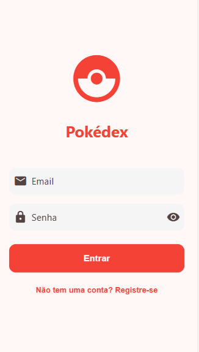

# 📱 Pokédex Flutter

Uma Pokédex interativa desenvolvida em **Flutter**, consumindo dados da [PokeAPI](https://pokeapi.co/). Projeto criado com o objetivo de praticar desenvolvimento mobile, consumo de API, gerenciamento de estado e otimização de performance.

## 🚀 Começando

Siga os passos abaixo para instalar, rodar o projeto localmente e gerar o APK.

### Pré-requisitos

- [Flutter SDK](https://docs.flutter.dev/get-started/install) instalado na máquina
- [Git](https://git-scm.com/) instalado
- Emulador Android/iOS ou dispositivo físico configurado

### Instalação e execução

```bash
# Clone o repositório
git clone https://github.com/MateusMoreira1/DES.MOB.git

# Acesse a pasta do projeto
cd PokedexFlutter

# Instale as dependências
flutter pub get

# Rode o aplicativo
flutter run
```

### Gerar APK para Android

```bash
flutter build apk --release
```

O APK gerado estará disponível em:

```bash
build/app/outputs/apk/release/app-release.apk
```

## 🛠️ Tecnologias Utilizadas

- **Flutter** — Framework para desenvolvimento multiplataforma
- **Dart** — Linguagem de programação
- **SQLite** — Armazenamento local de dados
- **cached_network_image** — Cache de imagens para melhor desempenho
- **Provider** — Gerenciamento de estado (se aplicável)
- **HTTP** — Consumo de APIs REST

---

## ✨ Funcionalidades

- Listagem de Pokémon com rolagem infinita
- Pesquisa de Pokémon por nome
- Filtros por Tipo e Geração
- Detalhamento completo do Pokémon:
  - Atributos (HP, Ataque, Defesa, etc.)
  - Habilidades e fraquezas
  - Evoluções
  - Sons (cries) dos Pokémon
  - Sprites com versões brilhantes
- Comparação de atributos entre Pokémon
- Cache de dados e imagens
- Carregamento otimizado e paginado
- Efeitos especiais para Pokémon Lendários e Míticos

---

## 🖼️ Prints da Aplicação

<p align="center">
  
  
</p>

---

## 📂 Código-fonte

O código está completamente versionado em Git, seguindo boas práticas de organização:

- `lib/` — Código principal
- `models/` — Modelos de dados
- `screens/` — Telas do aplicativo
- `widgets/` — Componentes reutilizáveis
- `services/` — Serviços de API e banco de dados
- `utils/` — Utilitários e helpers

---

## 🧑‍💻 Autor

- Desenvolvido por **[Mateus Moreira](https://github.com/MateusMoreira1)**

---

## 📢 Observações Finais

Este projeto foi desenvolvido com fins educacionais, focando em boas práticas de Flutter, arquitetura de aplicativos e otimização de recursos.
