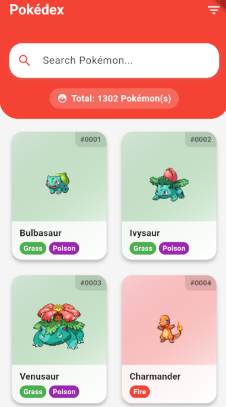

# 📱 Pokédex Flutter

Uma Pokédex interativa desenvolvida em **Flutter**, consumindo dados da [PokeAPI](https://pokeapi.co/).  
Projeto criado com o objetivo de praticar desenvolvimento mobile, consumo de APIs REST, gerenciamento de estado e otimização de performance.

---

## 🚀 Como Executar o Projeto

Siga os passos abaixo para instalar e rodar o aplicativo localmente, além de gerar o APK de produção.

### Pré-requisitos

- [Flutter SDK](https://docs.flutter.dev/get-started/install) instalado
- [Git](https://git-scm.com/) instalado
- Emulador Android/iOS ou dispositivo físico configurado

### Instalação

```bash
# Clone o repositório
git clone https://github.com/MateusMoreira1/DES.MOB.git

# Acesse a pasta do projeto
cd pokedex

# Instale as dependências
flutter pub get
```

### Execução

```bash
# Execute o aplicativo em modo debug
flutter run
```

### Gerar APK para Android

```bash
flutter build apk --release
```

O APK será gerado no caminho:

```
build/app/outputs/apk/release/app-release.apk
```

---

## 🛠️ Tecnologias Utilizadas

- **Flutter** — Framework multiplataforma para desenvolvimento mobile
- **Dart** — Linguagem de programação
- **SQLite** — Banco de dados local para cache de informações
- **cached_network_image** — Cache de imagens de rede
- **Provider** — Gerenciamento de estado (caso aplicável)
- **HTTP** — Consumo de APIs RESTful

---

## ✨ Funcionalidades Principais

- 🔍 Listagem e busca de Pokémon com rolagem infinita
- 🛡️ Filtros por tipo e geração
- 📖 Exibição completa de informações dos Pokémon:
  - Atributos (HP, Ataque, Defesa, etc.)
  - Habilidades e fraquezas
  - Evoluções
  - Sons (cries) originais
  - Sprites padrões e brilhantes
- ⚡ Carregamento otimizado com cache local
- 🧩 Comparação de atributos entre Pokémon
- 🎖️ Efeitos especiais para Pokémon Lendários e Míticos

---

## 🖼️ Prints da Aplicação

<p align="center">
  
  
</p>

---

## 📂 Organização do Código

O projeto é organizado seguindo boas práticas de estrutura de projetos Flutter:

- `lib/` — Código principal do aplicativo
  - `models/` — Modelos de dados
  - `screens/` — Telas da aplicação
  - `widgets/` — Componentes reutilizáveis
  - `services/` — Serviços para API e Banco de Dados
  - `utils/` — Funções utilitárias e helpers

---

## 🧑‍💻 Autor

Desenvolvido por **[Mateus Moreira](https://github.com/MateusMoreira1)**.

---

## 📢 Observações Finais

Este projeto foi desenvolvido com fins educacionais, focando em boas práticas de Flutter, arquitetura limpa, organização de código e otimização de performance em aplicativos mobile.
